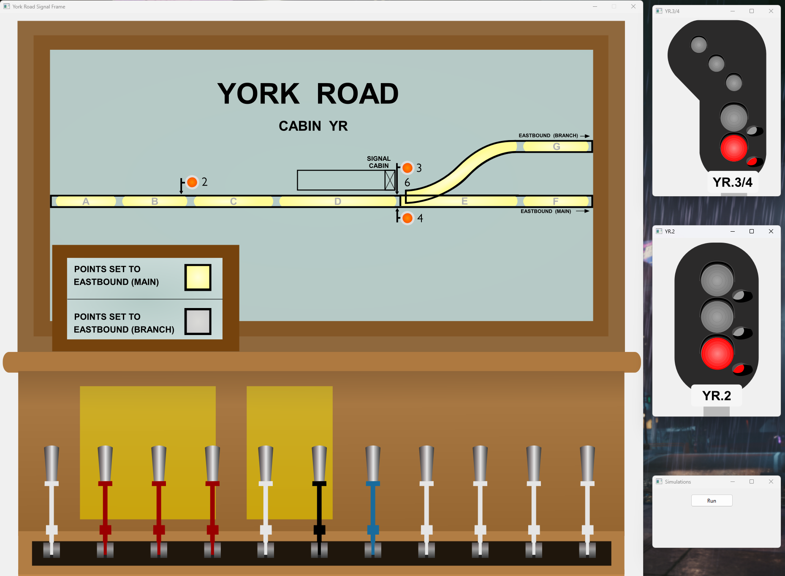

# York Road Signal Frame

A simulation of the York Road demonstration signal frame at the London Transport Museum's Acton Depot. 

## History

York Road station was located on the London Underground Piccadilly Line between King's Cross St Pancras and Caledonian Road stations. During its operation the signalling cabin at York Road operated a crossover.

## Operation

The simulation includes the signals for the York Road demonstration with working interlocking.

There are two main lever types to note in this simulation:

- The **Red** levers operate the signals, signal 2 controls the approach into York Road, signal 3/4 controls movements onto the junction either towards the main line (via lever 4) or the branch line (lever 3).
- The **Black** lever controls operation of the points for routing trains on either the main or branch lines, the state of the points being given by the points indicator in the foreground.

### Interlocking

To prevent any unauthorised movements being set the signal frame includes interlocking, in reality this consists of a set of horizontal and vertical bars which can only move in in set arrangements. For example the
clearing of signal 3 when the points are set to the main line would be an invalid action, and as such the lever is locked until the points are corrected. In the same way, points cannot be changed without first setting
signal 3/4 to danger.

To Route trains along the eastbound mainline:
 - Clear signal 2 to allow trains to enter York Road.
 - Ensure the points are set to route trains onto the main line.
 - Clear signal 4 to allow the train to continue.

To Route trains along the eastbound branch:
 - Clear signal 2 to allow trains to enter York Road.
 - Ensure the points are set to route trains onto the branch line.
 - Clear signal 3 to allow the train to continue.
